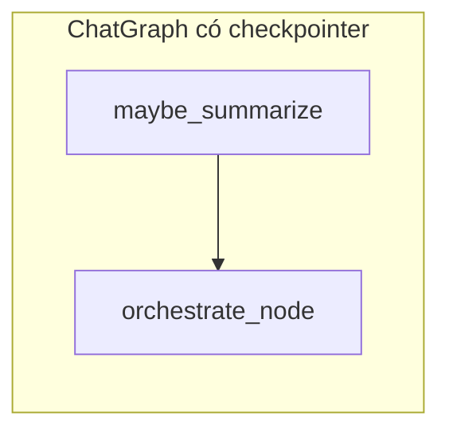

# Lưu trữ message trong chat và hướng “checkpoint là chính” (LangGraph)

Tài liệu này mô tả **hiện trạng** luồng lưu message và **hướng đích** khi dùng **Postgres checkpoint của LangGraph** làm nguồn sự thật cho bộ nhớ hội thoại.

---

## 1. Hiện trạng: cái gì đảm nhận vai trò gì?

| Thành phần | Vai trò |
|------------|--------|
| **PostgreSQL — bảng `session`, cột `content` (JSON)** | Lưu bền: `messages` (user/assistant), `conversation_summary`, `messages_summarized`, `pending_approval`, v.v. API/UI thường đọc lịch sử từ đây sau khi dữ liệu đã được ghi đầy đủ. |
| **Redis (stack)** | **Buffer ghi**: tin mới đẩy vào list Redis (`redis_stack_push`). Khi đủ batch (mặc định 20) hoặc khi flush tay → merge vào `content.messages` trong Postgres rồi xóa stack. Mục đích: **giảm số lần UPDATE** vào một row JSON. **Không** phải checkpoint LangGraph. |
| **`SessionManager`** (`mcp_agent/session/session_manager.py`) | Điều phối: `add_message`, `get_current_messages` (full transcript cho UI), `get_llm_context_messages` (tóm tắt + cửa sổ gần cho LLM), flush, compact summary. |
| **Guest / anonymous** | Không Postgres: lưu trong **`_memory`** (RAM). Không Redis. |
| **`langgraph_checkpointer`** | **Checkpoint LangGraph** (Postgres `AsyncPostgresSaver` hoặc `MemorySaver` nếu không có URI). Hiện chỉ gắn **mutation / create_table** workflow (`AgentState`) — interrupt/resume approval. **Không** lưu transcript chat dạng `MessagesState`. |
| **Orchestrator** (`StateGraph`) | `compile()` **không** có `checkpointer`. Mỗi lượt chỉ có `user_message` + `session_id` trong state — **không** có danh sách `messages` trong graph. |

### Luồng điển hình (user đăng nhập + Redis hoạt động)

1. User gửi tin → `add_message` → push vào **Redis stack**.
2. Đủ batch hoặc `flush` → merge stack → **Postgres** `content.messages`.
3. Khi gọi model → `get_llm_context_messages`: flush, đọc DB (+ stack nếu còn), ghép summary + tin gần.
4. **Workflow SQL** (mutation/create_table): graph `compile(checkpointer=...)` lưu **trạng thái workflow** vào bảng checkpoint Postgres (`thread_id` ≈ `session_id`), không thay thế lưu chat trong `SessionManager`.

**Tóm lại:** Bộ nhớ hội thoại cho chatbot **đang gắn với Postgres (+ Redis buffer) qua `SessionManager`**. Checkpoint LangGraph **chỉ** phục vụ một số workflow DB có human-in-the-loop.

---

## 2. Hướng đích: checkpoint (LangGraph) là chính

**Mục tiêu:** Transcript và (tuỳ chọn) tóm tắt nằm trong **state của graph** (thường là `MessagesState` hoặc mở rộng), được **AsyncPostgresSaver** (hoặc saver tương đương) ghi với:

```text
config = { "configurable": { "thread_id": "<session_id>" } }
```

### So sánh nhanh

| Hiện tại | Hướng checkpoint-first |
|----------|-------------------------|
| `messages` trong JSON `session` là nguồn chính cho LLM/UI sau flush | **Checkpoint** (bảng do LangGraph quản lý) chứa `messages` / state sau mỗi bước — **nguồn sự thật** cho model. |
| Redis stack batch vào `session` | **Không bắt buộc** cho chat: có thể bỏ stack cho history, hoặc chỉ giữ khi vẫn **sync** song song vào `session` cho API cũ (tối ưu ghi). |
| `get_llm_context_messages()` | Thay bằng đọc **state / checkpoint** sau `ainvoke`, hoặc node graph chuẩn bị `messages` trước khi gọi tools. |
| Orchestrator không có `messages` trong state | Thiết kế lại: graph chat có `MessagesState` (hoặc state mở rộng), orchestrator là node con hoặc được gọi sau bước ingest/summarize. |
| Summarize trong `SessionManager` | Chuyển sang **node summarize** trong cùng graph (cùng checkpointer). |
| Checkpoint chỉ cho mutation/create_table | Thêm graph “chat” dùng checkpointer; dùng **`checkpoint_ns`** hoặc graph id rõ ràng để **không lẫn** với workflow SQL. |

### Luồng khái niệm sau khi chuyển

```text
User message
  → graph.ainvoke(..., config { thread_id: session_id })
  → state: messages (+ summary nếu có)
  → node summarize (điều kiện)
  → node agent / tools
  → Postgres checkpoint ghi lại state

UI / API
  → Đọc từ: export snapshot sau mỗi turn, HOẶC sync nhẹ vào `session.content` (tuỳ chọn)
  → Redis: chỉ nếu vẫn muốn batch-update JSON session — không cần cho “đúng checkpoint”
```

---

## 3. Gợi ý thứ tự thay đổi

1. Định nghĩa **state** (MessagesState + trường phụ nếu cần) và **một** graph chat với **AsyncPostgresSaver** + `thread_id` ổn định.
2. Bọc hoặc thay phần **orchestrator** để mỗi request chat đi qua graph này.
3. **Refactor BaseAgent / tool loop**: nhận `messages` từ state, trả về phần cập nhật để graph merge — giảm phụ thuộc `SessionManager` cho context.
4. **API GET session**: hoặc projection từ checkpoint (phức tạp hơn), hoặc **sync** `messages` vào `session` sau mỗi turn để frontend ít đổi.
5. **Redis stack**: có thể **gỡ** khỏi đường chat để tránh hai nguồn sự thật; giữ Redis cho use-case khác (rate limit, cache, v.v.) nếu cần.

---

## 4. Vị trí Orchestrator khi chuyển sang graph chat (checkpoint-first)

Orchestrator hiện tại là `StateGraph(OrchestratorState)` **không** có `messages`, **không** checkpointer; các node gọi `AgentWorkflow.run` / agent bằng Python. Khi thêm **graph chat** (`MessagesState` + Postgres saver), có ba cách xếp Orchestrator:

### Cách A — Graph chat bao ngoài, Orchestrator thành **một node** (nên dùng lúc đầu)



- **Graph ngoài**: state có `messages` (+ summary nếu cần) + `AsyncPostgresSaver`, `thread_id = session_id`.
- Node **`orchestrate_node`**: một hàm async gọi **logic hiện tại** (ví dụ `Orchestrator.process_query` hoặc tách `_parse_intent` + route…) — **đọc** ngữ cảnh từ `state["messages"]`, **ghi** `response` và append tin assistant vào state trả về.
- **Không bắt buộc** biến Orchestrator thành subgraph LangGraph riêng; tránh `checkpoint_ns` lồng nhau khi chưa quen.

**Ưu:** Ít đụng graph routing bên trong; checkpoint bao trùm cả lượt chat. **Nhược:** Node orchestrate có thể vẫn “dày” nếu giữ nguyên toàn bộ nhánh.

### Cách B — **Gộp** intent/routing vào cùng một graph với `messages`

- Bỏ graph Orchestrator tách biệt; `PARSE_INTENT`, `DB_AGENT`, … là **node trên cùng graph** với `MessagesState`.
- **Ưu:** Một checkpoint thống nhất, dễ theo dõi từng bước. **Nhược:** Refactor lớn; phải hợp nhất state.

Phù hợp **giai đoạn sau** khi đã ổn checkpoint + một node orchestrate.

### Cách C — **Subgraph** LangGraph (graph con `compile` gắn vào node)

- Node cha gọi subgraph với state con / `checkpoint_ns`.
- **Ưu:** Module tách bạch. **Nhược:** Cấu hình namespace và map state phức tạp hơn.

Thường **chưa cần** nếu mục tiêu trước mắt chỉ là checkpoint cho `messages`.

### Gợi ý chốt

| Mục tiêu | Đặt Orchestrator ở đâu |
|----------|-------------------------|
| Nhanh có checkpoint + `messages` | **Cách A**: graph chat ngoài; class `Orchestrator` giữ làm **thư viện** được gọi từ một node (hoặc wrapper mỏng). |
| Một graph duy nhất, HITL từng bước rõ ràng | **Cách B** sau này. |
| Tách team / black box routing | **Cách C** khi đã quen checkpoint. |

**Tóm lại:** Nên **cho toàn bộ phiên chat** chạy trong **một graph có `MessagesState` + checkpointer**; Orchestrator **không nhất thiết** là subgraph — bắt đầu bằng **một node** đặt **sau** ingest (và summarize nếu có). Entry mới có thể là `ChatGraph.ainvoke` → node đó gọi logic trong `orchestration/orchestrator.py` đã chỉnh để nhận/trả state `messages`.

---

## 5. Vị trí Orchestrator hiện tại trong stack (trước khi refactor)

### Luồng gọi từ API

1. **HTTP** → `ChatUseCase.chat` (và các use case khác dùng agent) gọi `AgentRepository.get_agent(user_key)`.
2. **`AgentRepository`** tạo và cache **một instance `Orchestrator` cho mỗi `user_key`** (`_orchestrators[user_key]`).
3. **`Orchestrator`** (`mcp_agent/orchestration/orchestrator.py`) bọc: các agent (database, excel, superset), `SessionManager`, lazy `AgentWorkflow`, và **`orchestrator_graph`**: `StateGraph(OrchestratorState)` — `PARSE_INTENT` → route → `DB_AGENT` / `EXCEL_AGENT` / … → `AGGREGATE_RESPONSE`.

Use case gọi **`await agent.process_query(query, session_id=...)`** — tức **`Orchestrator.process_query`**, bên trong **`await self.orchestrator_graph.ainvoke({...})`**.

```text
POST /api/chat
  → ChatUseCase.chat
  → AgentRepository.get_agent(user_key)  →  Orchestrator (mỗi user một instance)
  → Orchestrator.process_query
       → orchestrator_graph.ainvoke  (PARSE_INTENT → … → AGGREGATE)
       → các node gọi AgentWorkflow.run / BaseAgent.process_query / …
  → ChatUseCase lưu history qua session_manager.add_message
```

### Bảng tham chiếu nhanh

| Khía cạnh | Vị trí |
|-----------|--------|
| **File** | `mcp-client/mcp_agent/orchestration/orchestrator.py` |
| **Được tạo** | `api-server/internal/repositories/agent_repository.py` — `Orchestrator(agents=..., session_manager=..., router_model=...)` |
| **Được gọi từ** | `api-server/internal/usecases/chat_usecase.py` — biến `agent` chính là `Orchestrator` |
| **Trong luồng HTTP** | Ngay **dưới** use case, **trên** agent/workflow cụ thể: lớp **điều phối** (intent + route + gọi workflow/agent). |
| **Checkpoint LangGraph** | Graph orchestrator `compile()` **không** có checkpointer; checkpoint chỉ ở workflow con (mutation/create_table), **không** ở graph orchestrator. |

**Tóm lại:** Orchestrator là **điểm vào điều phối chat** sau repository, một **LangGraph phẳng** (state **không** có `messages`), nằm **giữa** API và các agent / `AgentWorkflow`.

---

## 6. File code liên quan (tham chiếu nhanh)

| Nội dung | File |
|----------|------|
| Session, Redis stack, summary | `mcp-client/mcp_agent/session/session_manager.py` |
| Checkpoint Postgres / Memory | `mcp-client/mcp_agent/graph/langgraph_checkpointer.py` |
| Mutation / create_table + checkpointer | `mcp-client/mcp_agent/graph/mutation_workflow.py`, `create_table_workflow.py` |
| LLM context từ session | `mcp-client/mcp_agent/agents/base_agent.py` (`get_llm_context_messages`) |
| Orchestrator graph | `mcp-client/mcp_agent/orchestration/orchestrator.py` |
| Load session cho API | `api-server/internal/usecases/sessions_usecase.py` |
| Tạo Orchestrator per user | `api-server/internal/repositories/agent_repository.py` |
| Chat gọi `agent.process_query` | `api-server/internal/usecases/chat_usecase.py` |

---

## 7. Thuật ngữ

- **Checkpoint LangGraph:** Trạng thái graph được serialize (thường vào Postgres qua `AsyncPostgresSaver`), khôi phục theo `thread_id` / `checkpoint_ns`.
- **Redis stack trong project:** Chỉ là **hàng đợi ghi** trước khi merge vào JSON session — khác hoàn toàn checkpoint.

---

*Tài liệu này phản ánh kiến trúc tại thời điểm viết; khi refactor, cập nhật mục 1–5 cho khớp code.*
