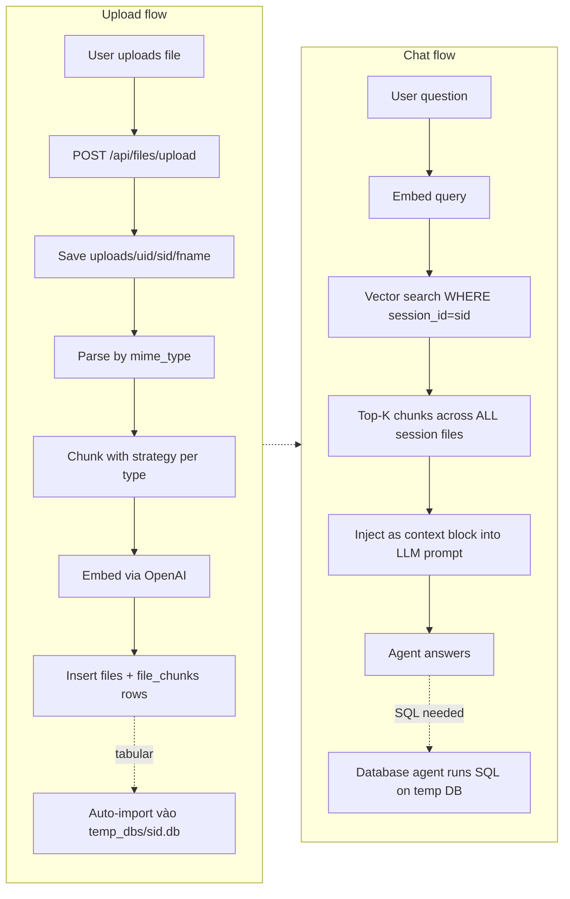

# RAG-style File Memory cho Chat Session

## Bối cảnh

Hiện tại mỗi turn chat user phải re-upload Excel (frontend `setAttachedExcel(null)` ở [`Chat.tsx:797`](frontend/src/pages/Chat.tsx)), gây ra:

- Cùng 1 file được lưu nhiều copy (xem 5 UUID khác nhau cho `50 product categories.xlsx` trong terminal log)
- Marker `[UPLOADED_EXCEL_PATH_*]` lặp ở mỗi user message → lịch sử phình
- Excel agent tải toàn bộ data → vượt 128K tokens của `gpt-4o-mini` → lỗi 400

Mục tiêu: ChatGPT/Claude-style — upload 1 lần, file nhớ lâu, có thể upload thêm file mới mà file cũ vẫn truy cập được; AI dùng RAG (pgvector) để retrieve chỉ phần liên quan, không nhồi cả file vào prompt.

## Kiến trúc



## Schema thay đổi

### Migration 0007: `migrations_pg/0007_create_files_and_chunks.up.sql`

```sql
CREATE EXTENSION IF NOT EXISTS vector;

CREATE TABLE IF NOT EXISTS files (
    id UUID PRIMARY KEY DEFAULT gen_random_uuid(),
    session_id TEXT NOT NULL REFERENCES session(id) ON DELETE CASCADE,
    user_id TEXT NOT NULL REFERENCES users(google_sub) ON DELETE CASCADE,
    filename TEXT NOT NULL,
    local_path TEXT NOT NULL,
    mime_type TEXT NOT NULL,
    size_bytes BIGINT NOT NULL DEFAULT 0,
    sqlite_table_name TEXT,        -- nếu tabular đã import vào temp DB
    sqlite_db_path TEXT,           -- path tới temp DB
    summary TEXT,                  -- nullable, tạo lazy
    uploaded_at TIMESTAMP NOT NULL DEFAULT CURRENT_TIMESTAMP
);

CREATE INDEX files_session_id_idx ON files (session_id);
CREATE INDEX files_user_id_idx ON files (user_id);

CREATE TABLE IF NOT EXISTS file_chunks (
    id UUID PRIMARY KEY DEFAULT gen_random_uuid(),
    file_id UUID NOT NULL REFERENCES files(id) ON DELETE CASCADE,
    session_id TEXT NOT NULL,      -- denormalized để index/scope nhanh
    chunk_text TEXT NOT NULL,
    embedding vector(1536) NOT NULL,
    metadata JSONB NOT NULL DEFAULT '{}'::jsonb,
    created_at TIMESTAMP NOT NULL DEFAULT CURRENT_TIMESTAMP
);

CREATE INDEX file_chunks_session_id_idx ON file_chunks (session_id);
CREATE INDEX file_chunks_file_id_idx ON file_chunks (file_id);
CREATE INDEX file_chunks_embedding_hnsw ON file_chunks
    USING hnsw (embedding vector_cosine_ops);
```

> Lưu ý: bạn cần cài extension `vector` trên Postgres. Nếu chạy local: `brew install pgvector` rồi `CREATE EXTENSION vector` (migration đã làm việc này). Nếu Postgres trong Docker, đổi image sang `pgvector/pgvector:pg16`.

## Cấu trúc thư mục mới

```
api-server/
├── uploads/{user_id}/{session_id}/{stored_filename}     -- thay layout cũ
├── temp_dbs/{session_id}.db                              -- per-session SQLite (mới)
└── internal/
    ├── repositories/file_repository.py                   -- mới
    ├── services/
    │   ├── file_parse_service.py                         -- mới
    │   ├── chunking_service.py                           -- mới
    │   ├── embedding_service.py                          -- mới
    │   └── retrieval_service.py                          -- mới
    ├── usecases/file_usecase.py                          -- mới
    └── controllers/file_controller.py                    -- mới (POST/GET/DELETE)
```

## Detail từng module

### 1. `embedding_service.py`

```python
# pseudo-code
class EmbeddingService:
    MODEL = "text-embedding-3-small"   # 1536-dim
    DIM = 1536

    async def embed_batch(self, texts: list[str]) -> list[list[float]]:
        # OpenAI batch API, chunk theo 100 texts/call
        # Retry on rate limit
```

### 2. `file_parse_service.py`

Dispatch theo `mime_type` / extension:

| Loại | Cách parse | Lib |
|---|---|---|
| `text/csv` | pandas → DataFrame | pandas |
| `application/vnd.ms-excel` / `*spreadsheetml*` | pandas → 1 DataFrame/sheet | pandas + openpyxl |
| `application/x-sqlite3` (.db) | sqlalchemy reflect tables → schemas + sample rows | sqlalchemy |
| `application/pdf` | pypdf → text per page | pypdf |
| `text/plain`, `text/markdown` | đọc raw | stdlib |

Trả về `ParsedFile` với:
- `kind`: `"tabular" | "document"`
- `summary`: schema/columns/page_count
- `payload`: cho tabular là `{sheet_name: DataFrame}`; cho document là `{page: text}`

### 3. `chunking_service.py`

Chunking strategy theo `kind`:

**Tabular files (CSV/Excel/.db)**:

- **Metadata chunk** (1 chunk/sheet hoặc 1 chunk/table): `"File: products.xlsx, Sheet: Sheet1, Columns: id, parent_id, name, slug, created_at, updated_at. Sample rows: ..."` (5 dòng đầu)
- **Window chunks**: mỗi 50 dòng kèm header → text giống TSV: `"id\tparent_id\tname\n14\tNULL\tdrill\n..."`
- **Metadata trong `file_chunks.metadata`**: `{"file_id":..., "filename":..., "sheet":"Sheet1", "row_start":1, "row_end":50, "kind":"window"}` hoặc `"kind":"schema"`

**Document files (PDF/text/md)**:
- Chunk theo 800 tokens với overlap 100 (dùng `tiktoken` hoặc `count_tokens_approximately`)
- Metadata: `{"page": N, "kind":"text"}`

### 4. `file_repository.py`

CRUD cơ bản dùng asyncpg pool:

```python
async def insert_file(...) -> UUID
async def insert_chunks_batch(file_id, session_id, chunks: list[(text, embedding, metadata)]) -> int
async def list_files_by_session(session_id, user_id) -> list[FileRow]
async def get_file(file_id, user_id) -> FileRow | None
async def delete_file(file_id, user_id) -> None  # cascade chunks + xóa local file
async def search_chunks(session_id, query_embedding, top_k=8) -> list[ChunkRow]
    # SELECT ..., embedding <=> $1 AS distance
    # FROM file_chunks WHERE session_id = $2
    # ORDER BY embedding <=> $1 LIMIT $3
```

### 5. `retrieval_service.py`

```python
async def retrieve_relevant_chunks(session_id: str, query: str, top_k: int = 8) -> list[ChunkResult]:
    query_emb = await embedding_service.embed_batch([query])
    rows = await file_repo.search_chunks(session_id, query_emb[0], top_k)
    return [ChunkResult(text, metadata, distance) for r in rows]

def format_chunks_as_context_block(chunks: list[ChunkResult]) -> str:
    # Trả về Markdown block để inject vào prompt:
    # "[ATTACHED FILES CONTEXT]\n<file:products.xlsx | rows 1-50>\n<chunk_text>\n---\n..."
    # Với rate limit: cap tổng tokens ≤ 4000 tokens
```

### 6. `file_usecase.py` (4 helper methods spec yêu cầu)

```python
class FileUseCase:
    async def upload_file(self, session_id, file: UploadFile, user_key) -> FileMeta:
        # 1. validate session ownership
        # 2. save to uploads/{user_id}/{session_id}/{stored_name}
        # 3. parse_service.parse(...)
        # 4. chunking_service.chunk(parsed)
        # 5. embedding_service.embed_batch([c.text for c in chunks])
        # 6. file_repo.insert_file(...) + insert_chunks_batch(...)
        # 7. nếu tabular → also import vào temp_dbs/<sid>.db (replace=False, table = sanitize(filename))
        # 8. return FileMeta(id, filename, table_name, summary)

    async def get_session_files(self, session_id, user_key) -> list[FileMeta]
    async def retrieve_relevant_chunks(self, session_id, query, top_k=8) -> list[ChunkResult]
    async def summarize_file(self, file_id, user_key) -> str:
        # gọi LLM tóm tắt từ metadata + 1-2 chunk đầu, lưu vào files.summary
    async def delete_file(self, file_id, user_key)
```

### 7. `file_controller.py`

```python
@router.post("/api/files/upload")           # multipart, fields: session_id, file
@router.get("/api/files")                   # ?session_id=...
@router.get("/api/files/{file_id}")
@router.delete("/api/files/{file_id}")
@router.post("/api/files/{file_id}/summarize")
```

## Sửa luồng chat để dùng RAG (KHÔNG dùng marker nữa)

### File: [`api-server/internal/usecases/chat_usecase.py`](api-server/internal/usecases/chat_usecase.py)

Thêm sau `loaded = await agent.session_manager.load_session(session_id)`:

```python
if file_usecase:
    chunks = await file_usecase.retrieve_relevant_chunks(current_session_id, original_user_query, top_k=8)
    if chunks:
        context_block = format_chunks_as_context_block(chunks)
        # Prepend vào query gửi xuống agent (không persist vào DB content)
        augmented_query = f"{context_block}\n\nUSER QUESTION:\n{original_user_query}"
        # Gửi augmented_query thay cho query
```

**Quan trọng (req 9)**: KHÔNG persist `augmented_query` vào `session.content.messages`. Chỉ là transient để gửi LLM. Khi `original_user_query` save xuống DB là raw question.

### File: [`mcp-client/mcp_agent/orchestration/intent_service.py`](mcp-client/mcp_agent/orchestration/intent_service.py)

System prompt classifier thêm rule:
- *"Nếu query có context block `[ATTACHED FILES CONTEXT]` chứa schema/table info → ưu tiên route `db_readonly` (chạy SQL trên temp DB) cho aggregation/filter; route `excel` chỉ khi user rõ ràng muốn format/chart trên file gốc."*

### File: [`mcp-client/mcp_agent/agents/database_agent.py`](mcp-client/mcp_agent/agents/database_agent.py)

System prompt thêm:
- *"Mỗi file user upload trong session có thể đã được import vào SQLite table. Schema được liệt kê trong `[ATTACHED FILES CONTEXT]`. Dùng `execute_query` trên các table đó để trả lời các câu hỏi aggregation/filter."*

## Frontend — file panel bền vững

### File: [`frontend/src/pages/Chat.tsx`](frontend/src/pages/Chat.tsx)

- Đổi `attachedExcel: <one>` → `attachedFiles: FileMeta[]`
- Bỏ logic gắn marker `[UPLOADED_EXCEL_PATH_*]` (line 778-781) vì backend tự retrieve
- **Bỏ** `setAttachedExcel(null)` sau send (line 797) — chip vẫn hiện tới khi user xóa
- Khi load session cũ → gọi `GET /api/files?session_id=X` → hiện list file
- Hiển thị: chip cho từng file, mỗi chip có nút "X" gọi `DELETE /api/files/{id}`
- Khi click upload, append vào list (không replace)

### File: [`frontend/src/pages/Home.tsx`](frontend/src/pages/Home.tsx)

Cùng cách xử lý — bỏ marker building logic.

### File: API client (`frontend/src/lib/api.ts` hoặc tương đương)

```typescript
listSessionFiles(sessionId): Promise<FileMeta[]>
uploadSessionFile(sessionId, file): Promise<FileMeta>
deleteSessionFile(fileId): Promise<void>
summarizeFile(fileId): Promise<{summary: string}>
```

## Hybrid: tabular files cũng được import vào SQLite

Trong `file_usecase.upload_file`, nếu `parsed.kind == "tabular"`:

1. Path: `api-server/temp_dbs/{session_id}.db` (tạo lazy nếu chưa có)
2. Sanitize table name: `sanitize_identifier(filename_without_ext)` → vd `products_xlsx_50_categories`
3. `df.to_sql(table_name, engine, if_exists="fail")` — KHÔNG replace để file cũ vẫn còn (req 7)
4. Lưu `sqlite_table_name` + `sqlite_db_path` vào `files` row
5. Khi chat: `chat_usecase` set `agent.connection_info` + connect agent tới `temp_dbs/{sid}.db` → DB agent dùng được

## Cleanup cascade

### Khi xóa session

File: `api-server/internal/usecases/session_usecase.py` (hoặc handler tương đương)

1. `SELECT local_path, sqlite_db_path FROM files WHERE session_id = $1` → list paths
2. Xóa các file uploaded khỏi disk
3. Xóa `temp_dbs/{session_id}.db`
4. `DELETE FROM session WHERE id = $1` → cascade tự xóa `files` và `file_chunks`

### Khi xóa từng file (DELETE /api/files/{id})

1. Lấy `local_path`, `sqlite_table_name`, `sqlite_db_path`
2. Xóa file disk
3. Drop table khỏi temp DB (nếu có)
4. `DELETE FROM files WHERE id = $1` → cascade chunks

## Token safety net (đề phòng RAG vẫn nổ)

### File: [`mcp-client/mcp_agent/graph/chat_graph.py`](mcp-client/mcp_agent/graph/chat_graph.py)

Thay (line 147):
```python
intent_msgs = summarized or msgs
```
bằng:
```python
intent_msgs = summarized or _truncate_to_token_budget(msgs, MAX_HISTORY_TOKENS)
```

Helper mới (~15 dòng), dùng `count_tokens_approximately` để giữ tin gần nhất trong budget.

### File: [`mcp-client/mcp_agent/agents/base_agent.py`](mcp-client/mcp_agent/agents/base_agent.py)

Cap tool result trước khi append vào messages (~10 dòng):
```python
content_str = _cap_tool_result(json.dumps(result_content), MAX_TOOL_RESULT_TOKENS)
```

ENV: `CHAT_HISTORY_HARD_CAP_TOKENS=20000`, `TOOL_RESULT_MAX_TOKENS=4000`.

## Files touched

- **Mới**: 7 file Python (repos/services/usecase/controller) + 1 migration `.sql` + 1 test
- **Sửa**: `chat_usecase.py`, `intent_service.py`, `database_agent.py`, `chat_graph.py`, `base_agent.py`, `Chat.tsx`, `Home.tsx`, `api.ts`
- **Deprecate (không xóa, để backward compat)**: marker `[UPLOADED_EXCEL_PATH_*]` parsing trong `chat_usecase.py` (vẫn parse để session cũ chạy được, nhưng không tạo mới)

**Tổng**: ~15 file thay đổi/thêm, ~600-800 dòng code, ~5-7 giờ work + test.

## Test plan

- [ ] Migration: chạy `0007_create_files_and_chunks.up.sql` không lỗi
- [ ] Upload `products.xlsx` (50 dòng × 6 cột) → 1 row trong `files`, ~3 row trong `file_chunks` (1 schema + 1 window 50 dòng + summary), table `products` xuất hiện trong `temp_dbs/<sid>.db`
- [ ] Hỏi *"unique values of product"* → top-K retrieve metadata + window chunks → DB agent SELECT DISTINCT → trả lời
- [ ] Upload `categories.csv` thêm trong cùng session → file cũ vẫn còn, list_files trả về 2 file
- [ ] Hỏi *"compare products vs categories"* → retrieve chunks từ CẢ 2 file → cross-file answer (req 13)
- [ ] Reload page → chip 2 file vẫn hiển thị
- [ ] Xóa từng file qua nút X → file disk xóa, table drop, chunks cascade
- [ ] Xóa session → cả 2 file disk xóa, temp DB xóa
- [ ] Test 5 turn liên tiếp KHÔNG re-upload → tất cả turns đều thấy chunks (req 5)
- [ ] Test load session cũ chỉ có marker → backward compat: chunks rỗng, agent vẫn xử lý qua marker cũ
- [ ] Test cap fallback: simulate RAG retrieve 100 chunks → format_chunks_as_context_block cap 4K tokens

## Rủi ro & mitigation

- **pgvector chưa cài**: cần document trong README setup hoặc thêm vào docker-compose (image `pgvector/pgvector:pg16`)
- **Embedding cost**: `text-embedding-3-small` ~$0.02/1M tokens. File 50 dòng ≈ 5K tokens ≈ $0.0001. OK cho MVP.
- **Embedding latency**: upload → embed có thể tốn 1-3s. Show "processing" indicator ở UI.
- **Backward compat**: session cũ không có rows trong `files`. Code phải coi `chunks=[]` là hợp lệ và rơi về marker-based flow cũ.
- **Concurrent uploads**: 2 file upload cùng lúc → cần file-level lock hoặc UNIQUE constraint trên `(session_id, sanitize(filename))` để tránh race trong table import.
- **Multi-file UX**: cần thiết kế UI nhỏ gọn để chip không tràn input bar — gợi ý: "X files attached" với popover khi >3 file.

## Default decisions (có thể đổi sau)

- Embedding model: `text-embedding-3-small` (1536-dim)
- Top-K: 8 chunks
- Tabular chunking: 1 metadata + N windows × 50 dòng
- Document chunking: 800 tokens, overlap 100
- Hybrid: tabular vẫn import vào SQLite cho SQL aggregation
- Token cap context block: 4000 tokens
- File path: `uploads/{user_id}/{session_id}/{uuid}_{filename}`
