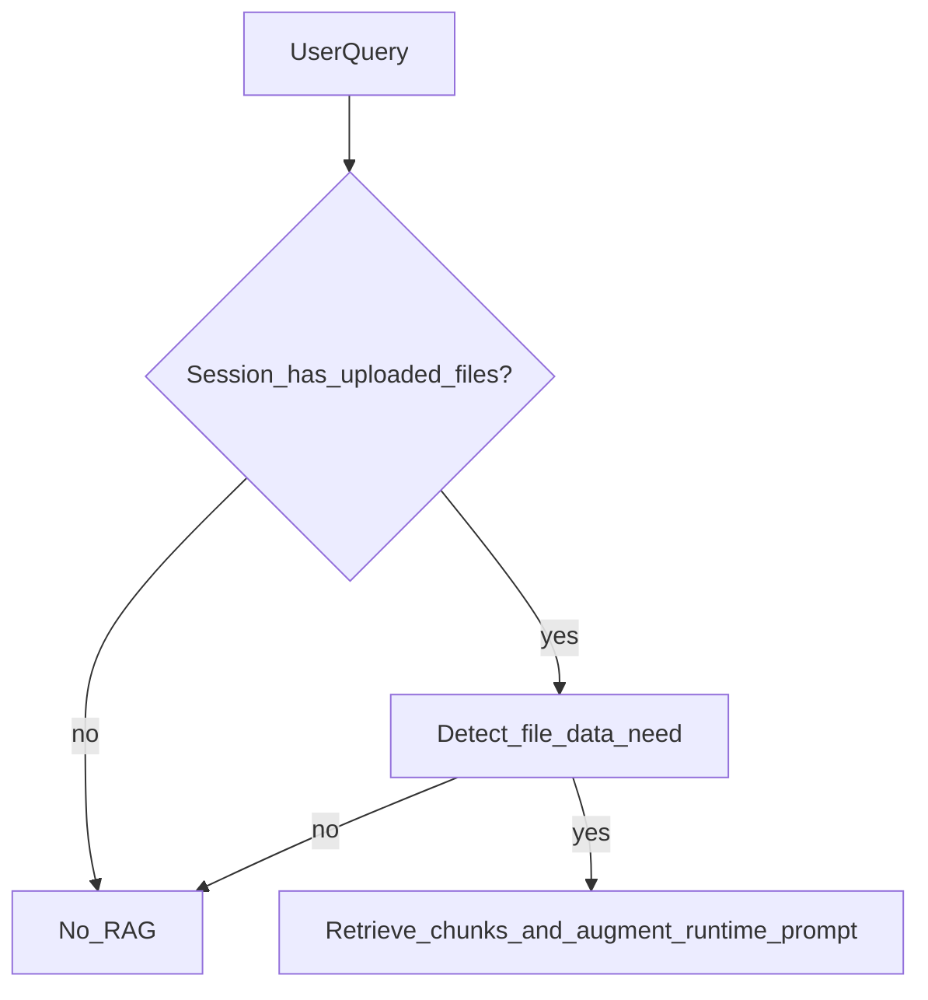

# Plan: RAG For All File-Related Queries

## Mục tiêu
- Nếu query cần dữ liệu từ uploaded file trong session thì **bật RAG**.
- Không giới hạn theo route `excel`; áp dụng cho mọi route khi câu hỏi thực sự phụ thuộc file upload.
- Query không liên quan uploaded file thì không inject retrieval context.

## Rule quyết định

## Phạm vi thay đổi
- Cập nhật [api-server/internal/usecases/chat_usecase.py](/Users/Christina/Documents/APCS/Y4/Thesis/mcp-server/api-server/internal/usecases/chat_usecase.py):
  - Đổi gating từ `route-based` sang `file-data-need-based`.
  - Dùng hybrid detector hiện có (heuristic + LLM when uncertain) để quyết định `needs_uploaded_file_data`.
  - Điều kiện cuối cùng:
    - `use_file_rag = has_session_files AND needs_uploaded_file_data`.
  - Không phụ thuộc route `excel`/`db_readonly` để bật RAG.

- Giữ nguyên nguyên tắc persistence:
  - Retrieval context chỉ dùng runtime prompt.
  - History chỉ lưu `original_user_query` (không persist chunk/context).

## Cập nhật prompt/điều hướng
- Trong planner/router prompt (IntentService), thêm chỉ dẫn:
  - Nếu câu hỏi cần dữ liệu từ uploaded file thì có thể dùng RAG context regardless of route.
  - Route vẫn quyết định tool/workflow; RAG chỉ là lớp context augmentation.

## Logging/observability
- Mở rộng log debug tại ChatUseCase:
  - `route`, `has_session_files`, `needs_uploaded_file_data`, `use_file_rag`, `decision_source`, `llm_latency_ms`.
- Mục tiêu: nhìn log biết rõ vì sao một query dùng/không dùng RAG.

## Test plan
- Session có file, query aggregate/filter trên file -> `use_file_rag=True`.
- Session có file, query semantic summary doc -> `use_file_rag=True`.
- Session có file, query ngoài ngữ cảnh file -> `use_file_rag=False`.
- Session không file -> luôn `use_file_rag=False`.
- Verify history không chứa `[ATTACHED FILES CONTEXT]`/retrieved chunks.